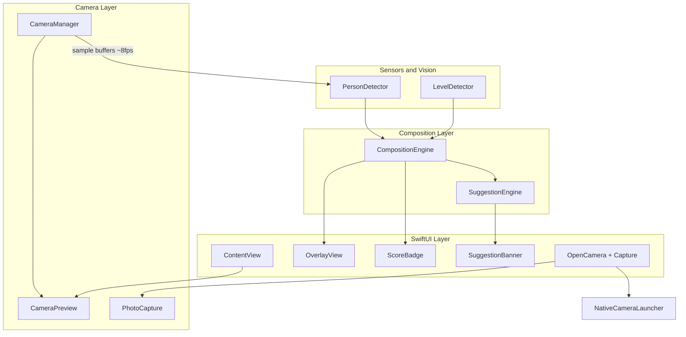

# PhotoFramer iOS MVP — Implementation Plan

## Stack recommendation: native SwiftUI (not Expo)

You know Expo, but **this MVP is a poor fit for Expo** because the core loop depends on tight integration between three Apple frameworks on every camera frame:

| Capability | Native iOS | Expo / RN |
|---|---|---|
| Live preview + photo capture | `AVFoundation` | `expo-camera` or `react-native-vision-camera` |
| Person detection on live frames | `Vision` (`VNDetectHumanRectanglesRequest`) | Custom native module or frame processor + ML Kit |
| Device level / tilt | `Core Motion` (`CMDeviceMotion`) | `expo-sensors` (less direct for horizon UX) |
| Save to Photos | `Photos` / `PHPhotoLibrary` | `expo-media-library` |
| Open system Camera | `UIApplication.open(camera://)` | `Linking.openURL` (same limitation) |

**Verdict:** SwiftUI + AVFoundation + Vision + Core Motion gets you to a working “parking sensors for photos” MVP faster, with fewer native bridges and better frame-rate control. Expo is better when the app is mostly UI/networking; FrameGuide is mostly camera + sensors + CV.

**Deployment target:** iOS 17.0+ (SwiftUI improvements, stable Vision human detection APIs).

**Workspace:** Empty [`PhotoFramer/`](PhotoFramer/). Branding is **locked** (see below).

---

## Design reference (Stitch)

**Folder:** [`stitch_photoframer_ios_ui_design_reference/`](stitch_photoframer_ios_ui_design_reference/)

| Asset | Purpose |
|---|---|
| [`travel_composition_system/DESIGN.md`](stitch_photoframer_ios_ui_design_reference/travel_composition_system/DESIGN.md) | Token spec (Travel Teal Material palette, typography, glass rules) — use for **onboarding only** |
| [`live_coaching_viewfinder_glass/code.html`](stitch_photoframer_ios_ui_design_reference/live_coaching_viewfinder_glass/code.html) | Overlay geometry reference (grid, level line, score position) — **do not copy** teal glass HUD, large CTA pill, or bottom tab bar |
| [`onboarding_permissions_glass/code.html`](stitch_photoframer_ios_ui_design_reference/onboarding_permissions_glass/code.html) | Permission screen layout reference (light sand/surface background) |

**Direction change (user preference):** Main screen should look **as close to the native iPhone Camera app as possible** — near-black translucent chrome, white icons, familiar bottom shutter row — with **coaching as thin live-feed overlays only**. The Stitch mockups are a starting point for overlay placement and composition tokens, not the camera chrome.

---

## Branding (locked)

### Product identity

| Field | Value |
|---|---|
| **App name** | PhotoFramer |
| **Home screen name** | PhotoFramer |
| **Xcode target / folder** | PhotoFramer |
| **Bundle ID (suggested)** | `com.<yourdomain>.photoframer` |
| **Tagline** | *Frame it right, before you shoot.* |
| **Positioning** | Live composition coach — guide first, not a camera replacement |

### UI paradigm: Native Camera shell + overlay cues

Two visual modes in the app:

**1. Camera screen (default) — mimic Apple Camera**

Match system Camera layout and affordances so the app feels like “Camera with coaching lines,” not a separate branded UI.

```
┌─────────────────────────────────────┐  ← status bar / Dynamic Island
│  [flash]              [grid] [•]    │  ← top bar: white icons, ~44pt tap targets
│                                     │
│     LIVE PREVIEW (edge-to-edge)     │
│     · white thirds grid (1px)       │
│     · horizon level line            │
│     · person box + ideal marker     │
│                                     │
│         "Step back"  (optional)     │  ← single white caption, SF Pro, no pill
│                                     │
│  [thumb]    ( ◯ shutter )    [↻]    │  ← bottom bar like Camera
│            PHOTO                    │  ← mode label (static “PHOTO” for MVP)
└─────────────────────────────────────┘
```

| Camera chrome element | PhotoFramer behavior |
|---|---|
| **Top-left** | Flash toggle placeholder (off/disabled MVP) OR hide — keeps visual parity |
| **Top-right** | Grid toggle (show/hide thirds); **compact score** (e.g. `84` monospaced, turns green when good) |
| **Center overlays** | Grid, horizon, person box, ideal marker — **no filled panels** |
| **Suggestion** | One line of white text with subtle black shadow, centered above bottom bar (Camera-style transient message) |
| **Bottom center** | **White shutter ring** — primary tap opens **iPhone Camera** (not in-app capture) |
| **Bottom left** | Last capture thumbnail (only after in-app capture) or empty gray circle |
| **Bottom right** | Flip camera icon (disabled/gray MVP — back camera only) OR replace with **small capture-in-app** secondary control |
| **Bottom bar** | `UIColor.black` @ ~50% behind controls; `.ultraThinMaterial` optional |
| **No tab bar** | Stitch bottom nav (Collections / School / Person) is **out of scope** for MVP |

**2. Onboarding / permission — Stitch light surfaces**

Use tokens from [`DESIGN.md`](stitch_photoframer_ios_ui_design_reference/travel_composition_system/DESIGN.md): `surface` `#f2fbff`, `primary` `#004752`, `on-surface` `#091e25`. SF Pro on device (Stitch uses Hanken Grotesk in HTML — do not bundle custom fonts for MVP).

### Color tokens

**Camera HUD (primary experience)**

| Token | Value | Usage |
|---|---|---|
| `hudForeground` | `#FFFFFF` | Icons, grid, labels |
| `hudForegroundDim` | `#FFFFFF` @ 55% | Disabled flip, inactive icons |
| `hudBackground` | `#000000` @ 50% | Bottom/top bar scrim |
| `shutterRing` | `#FFFFFF` stroke 4pt | Matches Camera shutter |
| `shutterInner` | `#FFFFFF` @ 30% fill | Inner circle when idle |
| `goodGreen` | `#30D158` (system green) | Score, horizon, box when score ≥ 80 |
| `adjustYellow` | `#FFD60A` (system yellow) | Score 40–79, level hint |
| `criticalOrange` | `#FF9F0A` | Score &lt; 40 |
| `gridLine` | `#FFFFFF` @ 35% | Rule of thirds |
| `subjectStroke` | `#FFFFFF` @ 60% | Person bounding box |
| `idealMarker` | `#FFFFFF` @ 80% | Target crosshair |

**Green/yellow/orange only on overlays and score — never on solid buttons.** The shutter stays white.

**Onboarding (from Stitch DESIGN.md)**

Map `primary`, `surface`, `on-surface`, `primary-container` from DESIGN.md into `AppTheme.swift` for permission screen only.

### Typography

- **Camera HUD:** SF Pro system fonts only (`.caption`, `.subheadline` for suggestion; `.caption.monospacedDigit()` for score).
- **Onboarding:** `.title2.bold`, `.body` — matches Apple HIG, close to Stitch hierarchy.

### SwiftUI theme file

[`PhotoFramer/Theme/AppTheme.swift`](PhotoFramer/PhotoFramer/Theme/AppTheme.swift):
- `CameraHUD` namespace (white/black/semantic)
- `Onboarding` namespace (Stitch / Travel Teal surface tokens from DESIGN.md)

### What we explicitly reject from Stitch mockups (camera screen)

- Teal `glass-panel` pills and large “Open iPhone Camera” text button
- Center-top coaching pill with icon + border
- Large glass score card (70px+ wide)
- Fixed bottom tab bar with Collections / School / Person
- Material Symbols (use SF Symbols: `camera`, `camera.rotate`, `grid`, `bolt.slash`)

---

## Product architecture



**UX principle:** Show **one primary suggestion** at a time (highest-priority failing rule). Score badge stays visible; turns **green** when score ≥ threshold (e.g. 80) and no critical issues.

---

## Project structure to create

```
PhotoFramer/
├── PhotoFramer.xcodeproj
├── PhotoFramer/
│   ├── PhotoFramerApp.swift
│   ├── Info.plist                    # permissions + display name
│   ├── ContentView.swift             # main screen
│   ├── Models/
│   │   ├── CompositionState.swift    # score, flags, person rect
│   │   └── FramingSuggestion.swift   # enum + display text
│   ├── Camera/
│   │   ├── CameraPermissionManager.swift
│   │   ├── CameraManager.swift         # session, outputs, sample buffers
│   │   ├── CameraPreviewView.swift     # UIViewRepresentable
│   │   └── PhotoCaptureService.swift   # AVCapturePhotoOutput + save
│   ├── Motion/
│   │   └── LevelDetector.swift         # CMDeviceMotion pitch/roll
│   ├── Vision/
│   │   └── PersonDetector.swift        # throttled VNDetectHumanRectangles
│   ├── Composition/
│   │   ├── CompositionRules.swift      # thresholds, weights
│   │   ├── CompositionEngine.swift     # score 0–100
│   │   └── SuggestionEngine.swift      # priority-ordered messages
│   ├── Theme/
│   │   └── AppTheme.swift              # Travel Teal color tokens
│   ├── UI/
│   │   ├── CameraChromeView.swift      # top/bottom bars mimicking Apple Camera
│   │   ├── CoachingOverlayStack.swift  # grid + horizon + person + marker
│   │   ├── GridOverlayView.swift
│   │   ├── HorizonOverlayView.swift
│   │   ├── SubjectMarkerView.swift
│   │   ├── PersonBoundingBoxView.swift
│   │   ├── CompactScoreView.swift      # small top-right numeric score
│   │   └── CoachingCaptionView.swift   # single-line suggestion above shutter
│   └── Services/
│       └── NativeCameraLauncher.swift
└── README.md                           # Xcode setup, permissions, limitations
```

---

## Screen layouts

### Main camera screen

See **UI paradigm: Native Camera shell** in Branding. Implementation priority: match Apple Camera chrome first, then layer coaching overlays from Stitch geometry reference.

**Interaction mapping:**
- **Shutter tap** → `NativeCameraLauncher` (open iPhone Camera)
- **Shutter long-press** (optional MVP+) → in-app capture
- **Alternate:** small `+` or `square.and.arrow.down` icon bottom-right for in-app capture if shutter must only open Camera
- **Grid button** → toggles `GridOverlayView` visibility (default on)

### Onboarding screen

Follow [`onboarding_permissions_glass/code.html`](stitch_photoframer_ios_ui_design_reference/onboarding_permissions_glass/code.html): light surface background, app mark, headline, 2–3 lines of copy, “Enable Camera” primary button (`primary` teal). No camera chrome on this screen.

---

## Feature implementation details

### 1. Camera permission + preview

- [`CameraPermissionManager`](PhotoFramer/PhotoFramer/Camera/CameraPermissionManager.swift): check `AVCaptureDevice.authorizationStatus`, request access, gate UI with explanation + Settings deep link if denied.
- [`CameraManager`](PhotoFramer/PhotoFramer/Camera/CameraManager.swift): `AVCaptureSession` preset `.high`, back wide camera, `AVCaptureVideoPreviewLayer` in representable, `AVCaptureVideoDataOutput` for Vision (delegate queue, `alwaysDiscardsLateVideoFrames = true`).
- [`CameraPreviewView`](PhotoFramer/PhotoFramer/Camera/CameraPreviewView.swift): `UIViewRepresentable` filling screen; handle rotation via `videoRotationAngle` (iOS 17+).

**Info.plist keys:**
- `NSCameraUsageDescription` — live framing guidance
- `NSPhotoLibraryAddUsageDescription` — save in-app captures

### 2. Horizon / level guide

- [`LevelDetector`](PhotoFramer/PhotoFramer/Motion/LevelDetector.swift): `CMMotionManager.startDeviceMotionUpdates` at 30 Hz; expose `roll` and `pitch` in degrees (gravity-aligned).
- **Horizon overlay:** rotate a horizontal 1px white line by `-roll` (Stitch reference: center crosshair area); tint `goodGreen` when level, `adjustYellow` when not (no teal).
- **Suggestions:** `Level the phone` when `abs(roll) > 4°`; `Raise camera` / `Lower camera` when pitch outside comfortable band (e.g. pitch &lt; -15° bird’s-eye, &gt; +10° too low).

### 3. Rule-of-thirds grid

- [`GridOverlayView`](PhotoFramer/PhotoFramer/UI/GridOverlayView.swift): two vertical + two horizontal lines at 33.3% / 66.6%; non-interactive; `allowsHitTesting(false)`.

### 4. Vision person detection

- [`PersonDetector`](PhotoFramer/PhotoFramer/Vision/PersonDetector.swift): `VNDetectHumanRectanglesRequest` on throttled frames (**~8 fps** max to limit heat/battery).
- Map Vision normalized rect → preview coordinates (account for aspect fill).
- If multiple people, use **largest bounding box** as primary subject for MVP.

### 5–6. Composition score + suggestions

**[`CompositionEngine`](PhotoFramer/PhotoFramer/Composition/CompositionEngine.swift)** computes weighted subscores (0–1 each), then `score = Int(weightedSum * 100)`.

| Rule | Weight | Pass condition (MVP) |
|---|---|---|
| Device level | 25% | `abs(roll) < 2°` |
| Pitch / camera height | 15% | pitch in [-12°, +8°] |
| Subject edge margin | 20% | person box inset ≥ 8% from each edge |
| Rule of thirds placement | 20% | person center within ~12% of nearest third intersection (not dead center) |
| Head/body not clipped | 10% | box not touching top/bottom with &lt; 2% margin |
| Sky / empty upper frame | 10% | upper-third luminance heuristic below threshold OR pitch not “looking up” |

**Heuristics without heavy ML:**
- **Too much sky:** average luma in top 33% of preview buffer &gt; threshold AND low variance (simple “bright flat sky” proxy); boost signal if pitch indicates upward tilt.
- **Landmark cut off:** defer true landmark CV; MVP uses **generic edge warning** if person box touches left/right with &lt; 5% margin → `Subject too close to edge` / treat as possible cut-off.
- **Step back / get closer:** person box area &gt; 45% of frame → closer; &lt; 12% → step back.
- **Move left/right:** person center offset from ideal third point horizontally.
- **Subject too centered:** person center within 8% of frame center on both axes.
- **No person:** score level + pitch + sky only; hide subject marker; suggestions focus on level + camera height + sky.

**[`SuggestionEngine`](PhotoFramer/PhotoFramer/Composition/SuggestionEngine.swift):** fixed priority list (first failing rule wins):

1. Level the phone
2. Raise / Lower camera (pitch)
3. Too much sky
4. Head/body cut off (top/bottom clip)
5. Subject too close to edge
6. Step back / Get closer
7. Move left / Move right
8. Subject too centered
9. **Frame is good** (when score ≥ 80 and no critical fails)

### 7. Ideal subject placement marker

- [`SubjectMarkerView`](PhotoFramer/PhotoFramer/UI/SubjectMarkerView.swift): when person detected, target = **nearest rule-of-thirds intersection** to “good” travel portrait default (prefer lower third: e.g. 33% x, 66% y in landscape-friendly orientation).
- Draw ring/crosshair at target; dashed line or arrow from person center to target when offset is large.

### 8. “Frame is good” state

- [`CompactScoreView`](PhotoFramer/PhotoFramer/UI/CompactScoreView.swift): small top-right monospaced score (no glass card); text color `goodGreen` / `adjustYellow` / `criticalOrange`; optional 2pt ring around score when good; haptic on green transition.
- [`CoachingCaptionView`](PhotoFramer/PhotoFramer/UI/CoachingCaptionView.swift): single white line, shadowed, no pill background — mimics Camera’s transient status text.
- [`CameraChromeView`](PhotoFramer/PhotoFramer/UI/CameraChromeView.swift): top bar (grid, score), bottom bar (thumbnail, shutter → open Camera, secondary capture control).

### 9. Open iPhone Camera

- [`NativeCameraLauncher`](PhotoFramer/PhotoFramer/Services/NativeCameraLauncher.swift): attempt `URL(string: "camera://")` via `UIApplication.shared.open`.
- **Important limitation:** Apple does not document a public Camera URL scheme; it works on many devices but is not guaranteed. Fallback UI: alert with “Open Camera from Home Screen” if open fails. This still matches your **guide-first** product decision.

### 10. In-app capture (included per your choice)

- Add `AVCapturePhotoOutput` to [`CameraManager`](PhotoFramer/PhotoFramer/Camera/CameraManager.swift).
- [`PhotoCaptureService`](PhotoFramer/PhotoFramer/Camera/PhotoCaptureService.swift): capture → `PHPhotoLibrary.requestAuthorization(for: .addOnly)` → `PHAssetCreationRequest`.
- Brief flash/shutter animation + toast “Saved to Photos”.
- **Note:** in-app stills will not match native Camera HDR/night quality — copy should say “For best quality, use iPhone Camera” near the secondary button.

---

## Data flow (per frame tick)

1. `LevelDetector` updates pitch/roll (30 Hz).
2. Every ~125 ms, latest sample buffer → `PersonDetector` → normalized `CGRect?`.
3. `CompositionEngine` merges motion + person + optional luma sample → `CompositionState`.
4. SwiftUI observes `CompositionState` → overlays + score + single suggestion.
5. Capture button bypasses analysis briefly to fire photo output.

---

## Testing plan (manual on device)

Simulator **cannot** validate camera/Vision reliably — use a physical iPhone.

- [ ] Deny/allow camera permission flows
- [ ] Grid + horizon track orientation
- [ ] Tilt phone → “Level the phone” and score drop
- [ ] Person in frame → bounding box + move-left/right hints
- [ ] Center subject → “Subject too centered”
- [ ] Open iPhone Camera button (and fallback message)
- [ ] Capture in app → appears in Photos
- [ ] Score turns green when aligned on thirds, level, with margins

---

## Out of scope for MVP (explicit)

- Pose templates / “stand like this” silhouettes
- Landmark-specific object detection
- Filters, editing, gallery browser
- Front camera / video recording
- On-device LLM coaching
- Stitch bottom tab bar (Collections / School / Person)
- Teal glass HUD panels on camera screen
- Custom fonts (Hanken Grotesk / Space Mono) — SF Pro / SF Mono only

---

## Implementation order (estimated)

1. Xcode project + app shell + permissions (0.5 day)
2. Live preview (0.5 day)
3. Grid + horizon + level detector overlays (0.5 day)
4. Vision person detection + bounding box (1 day)
5. Composition + suggestion engines + score UI (1 day)
6. Subject marker + green state + haptics (0.5 day)
7. Open Camera + in-app capture + Photos save (0.5 day)
8. README + device testing polish (0.5 day)

**Total:** ~5 days focused MVP.

---

## What you need locally

- Mac with Xcode 15+
- Apple Developer team for device testing (free provisioning OK for personal device)
- Physical iPhone for camera/Vision validation

After you confirm the plan, implementation will scaffold **PhotoFramer** with:
- **Camera screen:** Apple Camera chrome + overlay cues (per this plan)
- **Onboarding:** Stitch [`DESIGN.md`](stitch_photoframer_ios_ui_design_reference/travel_composition_system/DESIGN.md) surface tokens
- **Reference:** [`stitch_photoframer_ios_ui_design_reference/`](stitch_photoframer_ios_ui_design_reference/) for overlay geometry, not camera chrome
